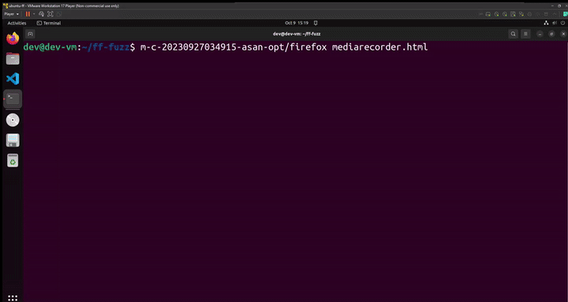
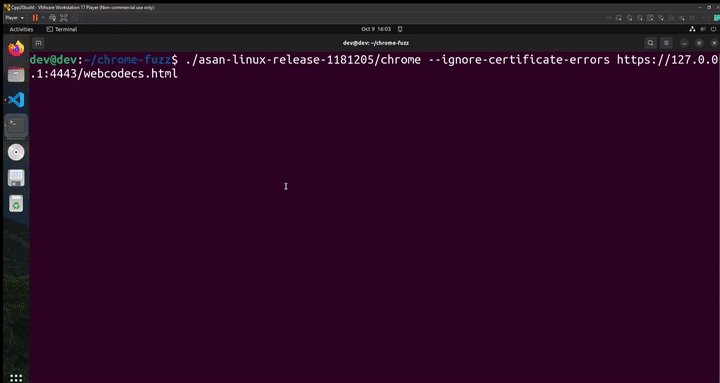

# CVE-2023-5217: libvpx VP8 Encoding Heap Overflow PoC

CVE-2023-5217 is an [in-the-wild](https://chromereleases.googleblog.com/2023/09/stable-channel-update-for-desktop_27.html) exploited libvpx vulnerability that was found by [Clément Lecigne](https://twitter.com/_clem1) of Google's Threat Analysis Group to be targeting Chrome.

This repo shows how to trigger [CVE-2023-5217](https://nvd.nist.gov/vuln/detail/CVE-2023-5217) in the browser using the [WebCodecs](https://w3c.github.io/webcodecs/) and [MediaRecorder](https://w3c.github.io/mediacapture-record/MediaRecorder.html) APIs. CVE-2023-5217 allows for a heap buffer overflow with a controlled overflow length and an overwrite of a repeated small 4-byte value. It is not currently known how CVE-2023-5217 was exploited in the wild. 

Around the time of public disclosure, there were two patches in libvpx and one in Chromium that remediated CVE-2023-5217. The libvpx patches included [disabling](https://github.com/webmproject/libvpx/commit/baed1218776fba096c05c1c683564ba4523d17e5) VP8 thread number changes and a [test](https://github.com/webmproject/libvpx/commit/452199ca85a3c968d31115345109c6d00d2a485b) for multithreaded encoding. The Chromium patch [disabled](https://chromium-review.googlesource.com/c/chromium/src/+/4893034) adjusting the number of threads in WebCodecs.

## Underlying Issue in libvpx v1.13.0 Ugly Duckling

### Summary
[libvpx](https://github.com/webmproject/libvpx) is a library that handles VP8/VP9 encoding and decoding.

The key issue in CVE-2023-5217 is that reducing the number of threads while increasing the frame height in a libvpx VP8 encoding session causes a linear heap overflow of a controlled length and controlled overwrite of a repeated small 4-byte value. The difference in frame height controls the length of the overwrite, and the new frame width controls the 4-byte value that is repeatedly written. This vulnerability can be exploited multiple times to continuously write different small 4-byte values by reducing the height in each subsequent config.

### Details

The libvpx VP8 encoder maintains an array called `mt_current_mb_col` that stores the current column being worked on by an encoder thread. This array is only allocated if there is more than one thread, and its size is a function of `mb_rows`, where `mb_rows = frame_height >> 4` and the `frame_height` is rounded up to the nearest multiple of 16.

```c
// https://github.com/webmproject/libvpx/blob/6512f994da13e2f27e6a7bd449efee0a374b55b7/vp8/common/alloccommon.c#L85
// The width and height are rounded up to a multiple of 16 and then assigned to `mb_rows` and `mb_cols`
int vp8_alloc_frame_buffers(VP8_COMMON *oci, int width, int height) {
    ...
    // Round up the width/height up to the nearest multiple of 16
    if ((width & 0xf) != 0) width += 16 - (width & 0xf);
    if ((height & 0xf) != 0) height += 16 - (height & 0xf);
    ...
    oci->mb_rows = height >> 4;
    oci->mb_cols = width >> 4;
    ...
}
// https://github.com/webmproject/libvpx/blob/6512f994da13e2f27e6a7bd449efee0a374b55b7/vp8/encoder/onyx_if.c#L1232
// This snippet shows the allocation of `mt_current_mb_col`
void vp8_alloc_compressor_data(VP8_COMP *cpi) {
  ...
  // Only allocate if we have more than 1 thread
  if (cpi->oxcf.multi_threaded > 1) {
    int i;

    vpx_free(cpi->mt_current_mb_col);
    // sizeof(*cpi->mt_current_mb_col) is 4
    CHECK_MEM_ERROR(&cpi->common.error, cpi->mt_current_mb_col,
                    vpx_malloc(sizeof(*cpi->mt_current_mb_col) * cm->mb_rows));
    for (i = 0; i < cm->mb_rows; ++i)
      vpx_atomic_init(&cpi->mt_current_mb_col[i], 0);
  }
  ...
}
```
Once libvpx finishes encoding a frame, it stores the number of columns encoded plus `mt_sync_range` into `mt_current_mb_col`.

```c
// https://github.com/webmproject/libvpx/blob/6512f994da13e2f27e6a7bd449efee0a374b55b7/vp8/encoder/onyx_if.c#L1212
// Snippet where the mt_sync_range value is set, based on the width.
void vp8_alloc_compressor_data(VP8_COMP *cpi) {
    ...
#if CONFIG_MULTITHREAD
  if (width < 640) {
    cpi->mt_sync_range = 1;
  } else if (width <= 1280) {
    cpi->mt_sync_range = 4;
  } else if (width <= 2560) {
    cpi->mt_sync_range = 8;
  } else {
    cpi->mt_sync_range = 16;
  }
#endif
  ...
}
// https://github.com/webmproject/libvpx/blob/6512f994da13e2f27e6a7bd449efee0a374b55b7/vp8/encoder/encodeframe.c#L560
// Function where the attacker chosen value is written
static void encode_mb_row(...) {
  ...
  const int nsync = cpi->mt_sync_range; // This value is set in vp8_alloc_compressor_data
  vpx_atomic_int rightmost_col = VPX_ATOMIC_INIT(cm->mb_cols + nsync);
  ...
  if (vpx_atomic_load_acquire(&cpi->b_multi_threaded) != 0) {
    current_mb_col = &cpi->mt_current_mb_col[mb_row];
  }
  ...
  if (vpx_atomic_load_acquire(&cpi->b_multi_threaded) != 0) {
    // current_mb_col is a reference to mt_current_mb_col
    vpx_atomic_store_release(current_mb_col,
                             vpx_atomic_load_acquire(&rightmost_col));
  }
  ...
}
```

To overflow `mt_current_mb_col`, we need three encoding configurations:
1. config<sub>init</sub>: During initialization, libvpx sets the initial_width and initial_height. These are the maximum possible bounds of later configurations. The number of threads here doesn't matter. We need the intermediate config because no subsequent width/height combinations can be larger than what we started with.
2. config<sub>vuln</sub>: During reconfiguration, if more than one thread is used then libvpx creates the vulnerable `mt_current_mb_col` allocation based on config<sub>vuln</sub>.height. This new height must be smaller than config<sub>init</sub>.initial_height or else we'll get [an error](https://github.com/webmproject/libvpx/blob/67bfb41ed8598edfb25bd6f245f9c39a68808548/vp8/vp8_cx_iface.c#L462).
3. config<sub>attack</sub>: During reconfiguration, if only one thread is used then libvpx will not reallocate `mt_current_mb_col` leaving it in a vulnerable state. libvpx will repeatedly write the value (config<sub>attack</sub>.width >> 4) + 1 (where 1 is the variable `mt_sync_range` and the width is rounded up to the nearest multiple of 16) outside of the previously allocated bounds when the following condition holds:
```math
\text{ceil}(\text{config}_{\text{init}}.\text{height}/16) \geq \text{ceil}(\text{config}_{\text{attack}}.\text{height}/16) \gt \text{ceil}(\text{config}_{\text{vuln}}.\text{height}/16)$$
```


More concretely, assume we initialize a VP8 encoding configuration with config<sub>init</sub> with width = 1200, height = 1200, threads = 4. The attack is as follows:
1. config<sub>vuln</sub> reconfigures the encoder with width = 500 (512 rounded up), height = 700 (704 rounded up), and threads = 2. The variable `mb_rows` is set to 704/16=44, and the array `mt_current_mb_col` is allocated to (44)*4 = 176 bytes. The value written stored in `mt_current_mb_col` is 512/16 + 1 = 33.
2. config<sub>attack</sub> reconfigures the encoder with width = 18 (32 rounded up), height = 1000 (1008 rounded up), and threads = 1. Because `mt_current_mb_col` is only reallocated when there is more than one thread, it stays the same size, yet `mb_rows` is now set to 1008/16 = 63. When libvpx calls `encode_mb_row`, it will overwrite (63-44)*4 = 68 bytes past the `mt_current_mb_col` allocation, repeatedly writing the value 32/16 + 1 = 3, where 32 is the rounded-up width, and 1 is the `mt_sync_range` value.
3. An attacker could re-exploit this vulnerability with a height smaller than the one in config<sub>attack</sub> but still larger than config<sub>vuln</sub> to write another value. For example, an attacker could create config<sub>attack'</sub> with width = 34 and height = 990, setting `mb_rows` = 992/16 = 62 and `mb_cols` = 48/16 = 3, writing only (62-44)*4 = 64 bytes past the original allocation the value 4.


## Exploitation

To exploit this vulnerability, an attacker needs to be able to control the encoding height, width, and number of threads. The former two are straightforward, but the latter requires finding places where the number of encoding threads is reconfigured.
```c
// https://github.com/webmproject/libvpx/blob/67bfb41ed8598edfb25bd6f245f9c39a68808548/vp8/vp8_cx_iface.c#L301
static vpx_codec_err_t set_vp8e_config(VP8_CONFIG *oxcf,
 ...
  oxcf->multi_threaded = cfg.g_threads;
```

### Firefox

In Firefox, we can control the number of threads by adjusting the frame area we are encoding in the VP8TrackEncoder. If the frame area is larger than 307,200 (a 640x480 frame) and the machine has more than 2 cores, then more than one thread will be used.
```cpp
// https://searchfox.org/mozilla-central/source/dom/media/encoder/VP8TrackEncoder.cpp#97
nsresult CreateEncoderConfig(...) {
  ...
  int32_t number_of_cores = PR_GetNumberOfProcessors();
  if (aWidth * aHeight > 1920 * 1080 && number_of_cores >= 8) {
    config->g_threads = 4;  // 4 threads for > 1080p.
  } else if (aWidth * aHeight > 1280 * 960 && number_of_cores >= 6) {
    config->g_threads = 3;  // 3 threads for 1080p.
  } else if (aWidth * aHeight > 640 * 480 && number_of_cores >= 3) {
    config->g_threads = 2;  // 2 threads for qHD/HD.
  } else {
    config->g_threads = 1;  // 1 thread for VGA or less
  }
  ...
```
We found that the MediaRecorder API relies on the VP8TrackEncoder, and we can adjust the width and height by changing the size of the canvas being recorded. See the [MediaRecorder](#mediarecorder) section below on how to call this.

### Chrome

Chrome similarly adjusts the number of threads based on the frame area being encoded, adjusted for the number of cores.

```cpp
// https://source.chromium.org/chromium/chromium/src/+/main:media/video/vpx_video_encoder.cc;l=84
EncoderStatus SetUpVpxConfig(...) {
  ...
  // Set the number of threads based on the image width and num of cores.
  config->g_threads = GetNumberOfThreadsForSoftwareEncoding(opts.frame_size);
}

// https://source.chromium.org/chromium/chromium/src/+/main:media/base/video_encoder.cc;drc=f5bdc89c7395ed24f1b8d196a3bdd6232d5bf771;l=33
int GetNumberOfThreadsForSoftwareEncoding(gfx::Size frame_size) {
  int area = frame_size.GetCheckedArea().ValueOrDefault(1);
  // Default to 1 thread for less than VGA.
  int desired_threads = 1;

  if (area >= 3840 * 2160) {
    desired_threads = 16;
  } else if (area >= 2560 * 1080) {
    desired_threads = 8;
  } else if (area >= 1280 * 720) {
    desired_threads = 4;
  } else if (area >= 640 * 480) {
    desired_threads = 2;
  }

  // Clamp to the number of available logical processors/cores.
  desired_threads =
      std::min(desired_threads, base::SysInfo::NumberOfProcessors());

  return desired_threads;
}
```

This path is exercised by the WebCodecs VideoEncoding API, where we can directly modify the encoding width/height. See the [WebCodecs](#webcodecs) section to see how this works.

### MediaRecorder

The file [mediarecorder.html](./mediarecorder.html) shows how to create a MediaRecorder session from a canvas and adjust the width/height to trigger a VP8 encoding reconfiguration to trigger CVE-2023-5217 in a vulnerable browser. When adjusting the canvas width and height parameters, we use a setTimeout to ensure the VP8 encoding session has enough time to reconfigure. The timeout parameter can be adjusted for reliability.

**Status**
- ✅ Firefox: Triggers a crash in the Firefox renderer.
- ❌ Chromium browsers: Chromium-based browsers do not change the number of threads when reconfiguring the encoder in a MediaRecorder session [[code](https://source.chromium.org/chromium/chromium/src/+/main:third_party/blink/renderer/modules/mediarecorder/vpx_encoder.cc;l=32)].
- ❌ Safari: WebKit does not support VP8 for MediaRecorder sessions [[code](https://github.com/WebKit/WebKit/blob/main/Source/WebCore/Modules/mediarecorder/MediaRecorderProvider.cpp#L71)].

#### Firefox Demo

To test on Firefox, you can use [fuzzfetch](https://github.com/MozillaSecurity/fuzzfetch) to get an ASAN build before this CVE was patched with the command `fuzzfetch --build 2023-09-27 -a` then open [mediarecorder.html](./mediarecorder.html) directly.



### WebCodecs

The files [webcodecs.html](./webcodecs.html) and [webcodecs.js](./webcodecs.js) show how to use the WebCodecs API in a Worker to trigger CVE-2023-5217 in a vulnerable browser. We have more control over the calls to encode a frame in WebCodecs than MediaRecorder but still rely on a timeout to change to perform each of the three steps.

**Status**
- ✅ Chromium browsers: Triggers a tab crash. This [Chromium patch](https://chromium-review.googlesource.com/c/chromium/src/+/4893034) for WebCodecs was included in the initial triage.
- ❌ Firefox: Firefox does not support WebCodecs encoding (decoding is enabled behind a config flag).
- 🚧 Safari: Safari supports WebCodecs encoding, but I was not able to get any crashes.

#### Chromium Demo

To test on Chromium, you can use [get_asan_chrome.py](https://source.chromium.org/chromium/chromium/src/+/main:tools/get_asan_chrome/get_asan_chrome.py) to get a vulnerable version of Chrome with the command `python get_asan_chrome.py --version 117.0.5938.131`. You'll then need to start a local HTTP server with SSL. See [gen_server_key.sh](./gen_server_key.sh) and [server.py](./server.py) to generate a server key and start a server. Then you can just open the page in the vulnerable Chromium to see the result.




### WebCodecs + MediaRecorder Combined

See [combined.html](./combined.html) which uses the MediaRecorder as fallback when WebCodecs isn't found. This combined file would be used to target both Chrome and Firefox with the same page.

## Conclusion

This vulnerability demonstrates the challenges and dangers of exposing complex media libraries to a remote attacker. Using tools like [RLBox](https://rlbox.dev/), browsers can isolate potential vulnerabilities in media libraries. Firefox already ships this in [select libraries](https://searchfox.org/mozilla-central/search?q=CONFIG%5B%22MOZ_WASM_SANDBOXING_&path=&case=false&regexp=false).

Thanks for reading! Contributions are welcome. Feel free to file an Issue or open a PR with any other insights. What is left to explore is seeing how this small 4-byte overwrite can lead to code execution.

Thanks to [Anand Balaji](https://github.com/d4rk-kn1gh7) for feedback on an earlier draft.